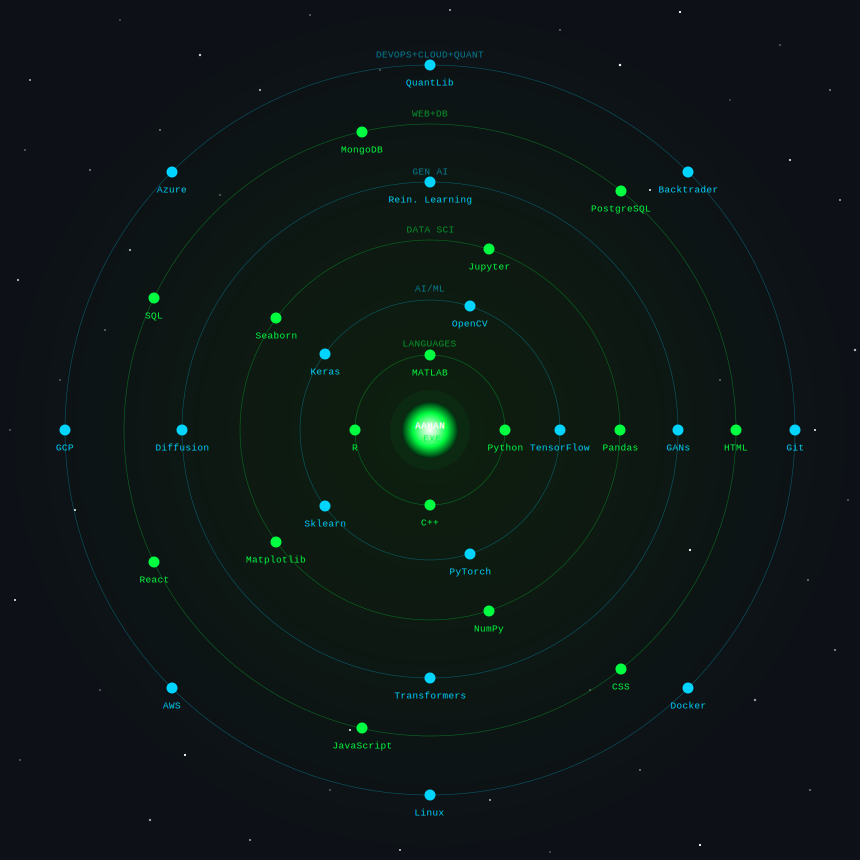

<div align="center">

<!-- Animated Matrix-style header banner -->


</div>

<div align="center">

<!-- Typing SVG Effect -->
[](https://git.io/typing-svg)

</div>

<div align="center">

```
╔══════════════════════════════════════════════════════════════════╗
║  > SYSTEM BOOT SEQUENCE COMPLETE                                 ║
║  > USER  :: Aahan Ajay Gajera        [B.Tech | AI & ML]         ║
║  > ROLE  :: AI Engineer + Quant Finance Enthusiast               ║
║  > STATUS:: Active | Building intelligent systems                ║
╚══════════════════════════════════════════════════════════════════╝
```

</div>

━━━━━━━━━━━━━━━━━━━━━━━━━━━━━━━━━━━━━━━━━━━━━━━━━━━━━━━━━━━━━━━━━━

## `$ whoami`

```python
class Aahan:
    def __init__(self):
        self.name       = "Aahan Ajay Gajera"
        self.role       = "B.Tech Student | AI & ML Specialization"
        self.interests  = ["Deep Learning", "Reinforcement Learning",
                           "Quantitative Finance", "Algorithmic Trading",
                           "Generative AI", "FinTech Engineering"]
        self.mission    = "Merging artificial intelligence with financial markets"
        self.status     = "Open to internships & research collaborations"

    def __repr__(self):
        return f"AI Engineer × Quant in the making 🧠📈"
```

━━━━━━━━━━━━━━━━━━━━━━━━━━━━━━━━━━━━━━━━━━━━━━━━━━━━━━━━━━━━━━━━━━

## `$ ls -la ./tech-stack`

<div align="center">



</div>

━━━━━━━━━━━━━━━━━━━━━━━━━━━━━━━━━━━━━━━━━━━━━━━━━━━━━━━━━━━━━━━━━━

## `$ cat ./domains.log`

```
┌─────────────────────────────────────────────────────────────┐
│  CORE DOMAINS                                               │
│                                                             │
│  [██████████] Reinforcement Learning          ACTIVE        │
│  [██████████] Deep Learning & Neural Nets     ACTIVE        │
│  [████████░░] Time-Series Forecasting         BUILDING      │
│  [████████░░] Generative AI                   BUILDING      │
│  [██████░░░░] Quantitative Finance            LEARNING      │
│  [██████░░░░] Algorithmic Trading             LEARNING      │
│  [████░░░░░░] Adaptive AI Systems             RESEARCHING   │
│  [████░░░░░░] FinTech Engineering             EXPLORING     │
└─────────────────────────────────────────────────────────────┘
```

━━━━━━━━━━━━━━━━━━━━━━━━━━━━━━━━━━━━━━━━━━━━━━━━━━━━━━━━━━━━━━━━━━

## `$ tail -f ./currently_learning.log`

```bash
$ python learn.py --module "Reinforcement Learning for Trading Strategies"
  ▸ Q-Learning, PPO, Actor-Critic models for market environments
  Output: [██████░░░░] 60% — in progress

$ python learn.py --module "Financial Time-Series Modeling"
  ▸ LSTM, Temporal Fusion Transformers, ARIMA-GARCH hybrids
  Output: [████░░░░░░] 40% — in progress

$ python learn.py --module "Generative AI Architectures"
  ▸ GANs | Transformers | Diffusion Models | VAEs
  Output: [████████░░] 80% — near completion

$ python learn.py --module "Quant Finance Fundamentals"
  ▸ Black-Scholes, Monte Carlo, Options Pricing, Portfolio Theory
  Output: [███░░░░░░░] 30% — just started
```

━━━━━━━━━━━━━━━━━━━━━━━━━━━━━━━━━━━━━━━━━━━━━━━━━━━━━━━━━━━━━━━━━━

## `$ cat ./objectives.cfg`

```yaml
career_target:
  primary   : Quantitative Finance Engineer
  secondary : AI/ML Research Scientist

open_to:
  - Internships in AI, ML, or FinTech
  - Research collaborations (RL, GenAI, Time-Series)
  - Open-source contributions
  - Quant Finance projects

collaboration:
  - AI/ML pipelines with real-world applications
  - Algorithmic trading systems
  - Financial modeling & simulation
  - Generative AI experiments
```

━━━━━━━━━━━━━━━━━━━━━━━━━━━━━━━━━━━━━━━━━━━━━━━━━━━━━━━━━━━━━━━━━━

## `$ git log --stat ./stats`

<div align="center">

<!-- GitHub Stats Cards Row -->

&nbsp;


</div>

<div align="center">

<!-- Streak Stats -->


</div>

<div align="center">

<!-- Coding GIF — dark matrix themed -->


</div>

<div align="center">

<!-- Activity Graph -->


</div>

<div align="center">

```
// $ snake --eats --contributions --palette=github-dark
```

<!-- Snake animation (auto-generated by GitHub Actions daily) -->


</div>


━━━━━━━━━━━━━━━━━━━━━━━━━━━━━━━━━━━━━━━━━━━━━━━━━━━━━━━━━━━━━━━━━━

## `$ ping ./connections`

<div align="center">

[](https://linkedin.com/in/aahan-gajera)
[](mailto:aahan060505@gmail.com)
[](https://github.com/aahan0605)
[](#)

</div>

━━━━━━━━━━━━━━━━━━━━━━━━━━━━━━━━━━━━━━━━━━━━━━━━━━━━━━━━━━━━━━━━━━

<div align="center">

```
╔═══════════════════════════════════════════════════════╗
║  "Markets are noisy. Intelligence cuts through it."   ║
║   — Aahan Gajera, somewhere between epochs            ║
╚═══════════════════════════════════════════════════════╝
```

<!-- Visitor Counter -->


<!-- Footer wave -->


</div>
