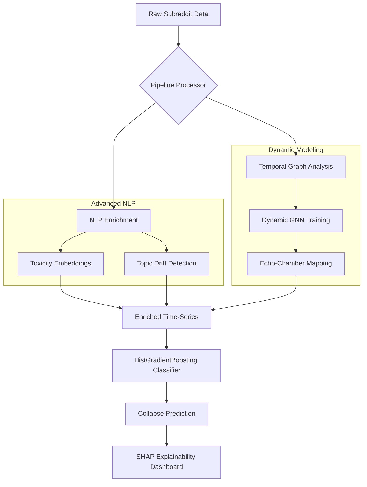

<div align="center">

# 🌌 Community Collapse Modeling
### *Forecasting Digital Echo-Chamber Fragmentation with GNNs & NLP*

[](https://python.org)
[](https://pytorch.org)
[](https://huggingface.co)
[](LICENSE)

---

**Predicting the "death-spiral" of online communities before they happen.**  
This project employs Enterprise-grade ML to identify structural decay in digital spaces using Temporal Graph Neural Networks and Deep NLP.

[Explore Visualizations](#-visualizations) • [System Architecture](#-system-architecture) • [Getting Started](#-installation--setup)

</div>

---

## 🏗️ System Architecture

The pipeline processes raw behavioral time-series and semantic discourse through a multi-stage AI framework:



---

## 🚀 Core Technological Pillars

### 🧠 Dynamic Graph Neural Networks (GNNs)
We don't just look at engagement; we look at **structure**. By mapping user-to-user interactions as a dynamic graph, the system identifies when a community's social fabric begins to fray—often weeks before engagement metrics reflect a collapse.

### 🎭 Semantic NLP (Topic Drift & Toxicity)
Using **Hugging Face Transformers**, we extract high-dimensional latent patterns in discourse:
- **Toxicity Volatility**: Identifying the "tipping point" of hostile interactions.
- **Topic Drift**: Quantifying the loss of community identity through semantic fragmentation.

### 🔍 Explainable AI (XAI) with SHAP
Integrated **SHAP (SHapley Additive exPlanations)** to provide "Glass Box" transparency. Every prediction is backed by detailed feature-contribution analysis, showing exactly which behavioral proxies triggered the alarm.

---

## 📊 Visualizations

The output dashboard provides high-fidelity insights into the community life-cycle:

- **Anatomy of a Collapse**: A "Post-Mortem" view of engagement vs historical peaks.
- **Early Warning Radar**: Predictive probability curves forecasting failure events.
- **Behavioral Radar**: Comparative radar charts of Healthy vs. Decaying states.

---

## 🛠️ Installation & Setup

> [!TIP]
> This project utilizes a safe, isolated virtual environment (`nlp_env`) to manage complex ML dependencies like PyTorch and Transformers.

### 1. Initialize Safe Environment
```bash
python3 -m venv nlp_env
source nlp_env/bin/activate
```

### 2. Install Core Stack
```bash
pip install torch torch_geometric transformers sentence-transformers \
            shap xgboost pandas numpy scikit-learn \
            seaborn matplotlib networkx jupyter
```

---

## 🔄 Execution Workflow

Follow this sequence to execute the full end-to-end forecasting pipeline:

1.  **Extract Semantics**: `python nlp_feature_extraction.py`
2.  **Enrich Dataset**: `python preprocess_data_weekly_enriched.py`
3.  **Train Topology**: `python gnn_dynamic_training.py`
4.  **Forecast & Explain**: `python generate_notebook.py`

---

<div align="center">
    <i>Developed for high-scale digital community analysis and predictive social modeling.</i>
</div>
